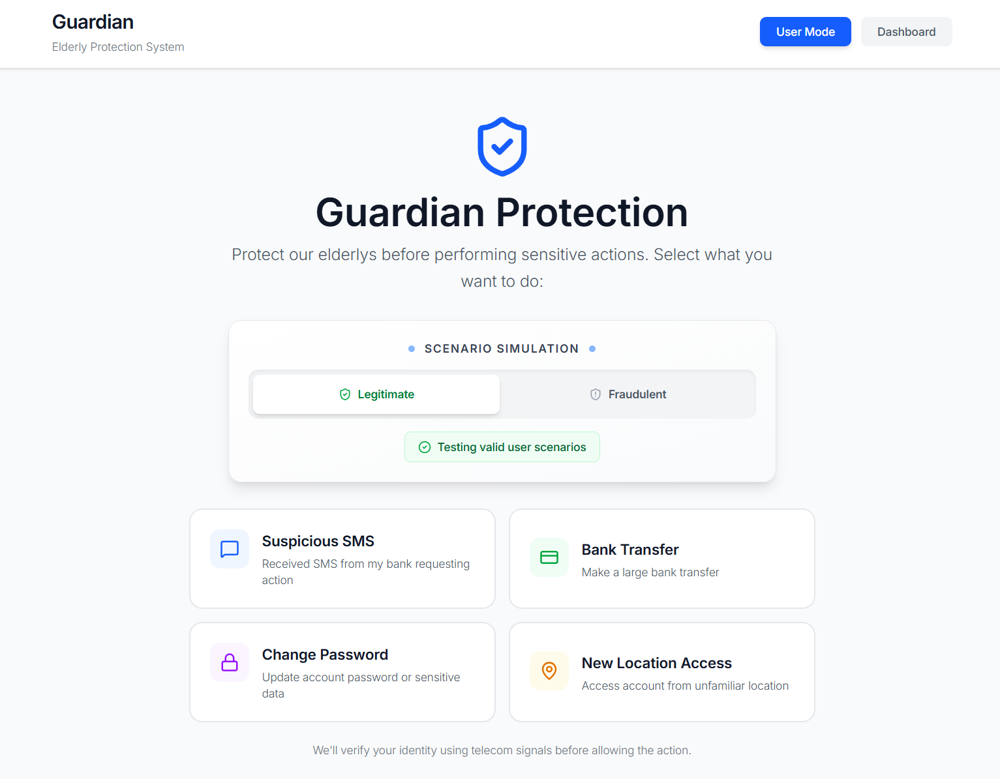

# Guardian MVP - Sistema de Protección contra Fraude Telecom

**Open Gateway Hackathon 2026 - Barcelona (Talent Arena)**

Sistema de protección de identidad para personas de tercera edad usando APIs de Nokia, Model Context Protocol (MCP) e inteligencia artificial Gemini.



---


## Descripción General

Guardian es un motor de inteligencia automático que protege a usuarios vulnerables contra fraudes telefónicos. El sistema:

1. Genera escenarios de prueba realistas (SMS, transferencias, cambios de contraseña, ubicaciones)
2. Analiza el contenido para detectar indicadores de riesgo
3. Decide qué verificaciones ejecutar según el nivel de amenaza
4. Calcula una puntuación de confianza (Trust Score)
5. Proporciona explicaciones claras en lenguaje simple
6. Permite o bloquea la operación automáticamente

**Importante:** No es un chatbot conversacional, sino un sistema de análisis y decisión automática.

---

## Funcionamiento del Sistema


### Flujo de Trabajo

```
USUARIO SELECCIONA ACCIÓN SENSIBLE
(SMS / Transferencia / Contraseña / Ubicación)
          ↓
┌────────────────────────────────────────────────────────┐
│  Frontend - Interfaz de Usuario                        │
│  Selecciona: Safe (Legítimo) / Fraudulent (Sospechoso) │
└────────────┬───────────────────────────────────────────┘
             │
             ▼
┌────────────────────────────────────────────────────────┐
│  Backend - Proceso Inteligente en 5 Pasos              │
│                                                        │
│  PASO 1: Generar contenido contextual                  │
│          SMS real de base de datos / Transferencia /   │
│          Cambio de contraseña / Acceso por ubicación   │
│                                                        │
│  PASO 2: Análisis inteligente del contenido            │
│          Detecta indicadores de riesgo                 │
│          Decide qué verificaciones ejecutar:           │
│          - Alto riesgo → SIM Swap + KYC                │
│          - Medio riesgo → SIM Swap o KYC               │
│          - Bajo riesgo → Ninguna (ahorro de recursos)  │
│                                                        │
│  PASO 3: Ejecutar verificaciones necesarias            │
│          Consulta APIs de Nokia si es necesario        │
│                                                        │
│  PASO 4: Calcular puntuación de confianza              │
│          Trust Score (0-100)                           │
│                                                        │
│  PASO 5: Generar explicación en lenguaje simple        │
│          Solo si el score es menor a 75                │
│                                                        │
└────────────┬───────────────────────────────────────────┘
             │
             ▼
┌────────────────────────────────────────────────────────┐
│  Resultado Visual para el Usuario                      │
│                                                        │
│  1. Contenido: "¡URGENTE! Haga clic aquí..."           │
│  2. Análisis: Alto Riesgo → SIM_SWAP + KYC             │
│  3. Verificaciones: SIM Swap detectado                 │
│  4. Trust Score: 40/100 → MODO PROTECCIÓN              │
│  5. Explicación clara para el usuario                  │
│                                                        │
│  DECISIÓN: OPERACIÓN BLOQUEADA                         │
└────────────────────────────────────────────────────────┘
```

---

## Puntuación de Confianza (Trust Score)

El sistema calcula una puntuación de 0 a 100 basada en señales de seguridad:

| Señal de Riesgo | Penalización | Fuente de Datos |
|------------------|--------------|-----------------|
| SIM Swap reciente | -60 puntos | Nokia SIM Swap API |
| KYC no coincide | -30 puntos | Nokia KYC Match API |

### Estados del Sistema

- **NORMAL** (75-100 puntos): Operación permitida
- **WARNING** (50-74 puntos): Advertencia al usuario
- **PROTECTION_MODE** (<50 puntos): Operación bloqueada, se activa protección

---

## Motor de Decisión Inteligente

El sistema utiliza Model Context Protocol (MCP) para tomar decisiones eficientes:

### Generación de Contenido

El sistema genera escenarios realistas para cada tipo de acción:

- **SMS**: Utiliza base de datos real con mensajes clasificados como fraudulentos o legítimos
- **Transferencias**: Genera transacciones con destinatarios, montos e IBANs sospechosos o confiables
- **Contraseñas**: Simula cambios desde dominios oficiales o sitios de phishing
- **Ubicación**: Simula accesos desde localizaciones normales o de alto riesgo

### Decisión Inteligente de Verificaciones

El sistema no ejecuta todas las verificaciones en cada caso, optimizando recursos:

| Nivel de Riesgo | Verificaciones Ejecutadas | Beneficio |
|-----------------|---------------------------|-----------|
| Bajo | Ninguna | Sin costos de API |
| Medio | SIM Swap o KYC | Una llamada API |
| Alto | SIM Swap + KYC | Verificación completa |

**Ventaja principal:** El sistema evita llamadas innecesarias a APIs cuando el contenido es claramente legítimo, reduciendo costos operativos.

### Proceso Completo

```
Contenido Generado
      ↓
Análisis de Indicadores de Riesgo
      ↓
Decisión: ¿Qué verificar?
      ↓
Ejecución de Verificaciones
      ↓
Cálculo de Trust Score
      ↓
Explicación en Lenguaje Simple
```

---

## Tecnologías Utilizadas

### APIs de Nokia

- **SIM Swap API** (`/sim-swap/v0/check`): Detecta cambios recientes de tarjeta SIM
- **KYC Match API** (`/kyc-match/v0.3/match`): Verifica que los datos del usuario coincidan

---

## Estructura del Proyecto

```
guardian-mvp/
├── backend/
│   ├── src/
│   │   ├── constants.js              # Datos unificados del usuario
│   │   ├── db.js                     # Conexión a base de datos
│   │   ├── routes/
│   │   │   └── guardian.js           # Endpoints principales
│   │   └── services/
│   │       ├── nokiaService.js       # Integración APIs Nokia
│   │       ├── trustScoreService.js  # Cálculo de puntuación
│   │       └── aiService.js          # Motor MCP y generación IA
│   └── server.js
│
├── frontend/
│   ├── src/
│   │   ├── constants.js              # Configuración
│   │   ├── App.jsx                   # Interfaz de usuario
│   │   └── index.css                 # Estilos
│   └── vite.config.js
│
├── studio_results_20260303_1021.json # Base de datos de SMS
└── README.md
```

---

## Endpoints de la API

### 1. POST `/guardian/mcp-check` - Principal

Proceso completo: genera contenido, analiza, verifica y calcula puntuación.

**Solicitud:**
```json
{
  "phone": "640033282",
  "firstName": "JOHN",
  "lastName": "OPENTEST",
  "birthDate": "1976-04-16",
  "actionType": "sms",
  "isFraudulent": true
}
```

**Tipos de acción disponibles:**
- `sms`: Mensajes de texto
- `transfer`: Transferencias bancarias
- `password`: Cambios de contraseña
- `location`: Accesos por ubicación

**Respuesta:**
```json
{
  "action": {
    "content": "¡URGENTE! Su cuenta ha sido bloqueada...",
    "actionType": "sms",
    "isFraudulent": true
  },
  "mcpAnalysis": {
    "riskLevel": "high",
    "riskIndicators": ["URL_SOSPECHOSA", "LENGUAJE_URGENTE"],
    "verificationsNeeded": ["SIM_SWAP", "KYC"],
    "reasoning": "URL sospechosa y lenguaje de urgencia detectados."
  },
  "verifications": {
    "simSwap": false,
    "kycMatch": true
  },
  "trustScore": 70,
  "status": "WARNING",
  "explanation": "...",
  "steps": [
    { "step": 1, "name": "Generando contenido", "status": "completed" },
    { "step": 2, "name": "Analizando contenido", "status": "completed" },
    { "step": 3, "name": "Ejecutando verificaciones", "status": "completed" },
    { "step": 4, "name": "Calculando Trust Score", "status": "completed" },
    { "step": 5, "name": "Generando explicación", "status": "completed" }
  ]
}
```

---

### 2. POST `/guardian/check` - Verificación Directa

Verificación con APIs Nokia sin generación de contenido.

**Solicitud:**
```json
{
  "phone": "640033282",
  "firstName": "JOHN",
  "lastName": "OPENTEST",
  "birthDate": "1976-04-16",
  "actionType": "transfer"
}
```

**Respuesta:**
```json
{
  "trustScore": 100,
  "status": "NORMAL",
  "actionAllowed": true,
  "explanation": "...",
  "sim": { "recentSwap": false },
  "kyc": { "match": true }
}
```

---

### 3. POST `/guardian/simulate` - Demostración

Simulaciones predefinidas para demostraciones sin llamadas a APIs externas.

**Escenarios disponibles:**
```json
{ "scenario": "safe" }        // Usuario seguro (score 100)
{ "scenario": "simswap" }     // SIM Swap detectado (score 40, bloqueado)
{ "scenario": "kyc" }         // KYC no coincide (score 70, advertencia)
{ "scenario": "maximum" }     // Ambos problemas (score 10, bloqueado)
```

---

### 4. POST `/guardian/generate-action` - Prueba de Generación

Genera contenido de prueba sin ejecutar verificaciones.

**Solicitud:**
```json
{
  "actionType": "sms",
  "isFraudulent": true
}
```

**Respuesta:**
```json
{
  "content": "¡URGENTE! Su cuenta ha sido bloqueada...",
  "actionType": "sms",
  "isFraudulent": true,
  "details": { "source": "studio_results" }
}
```

---

### 5. GET `/guardian/history` - Historial

Obtiene el historial de verificaciones realizadas.

---

## Datos de Prueba

El sistema utiliza datos de prueba consistentes definidos en `constants.js`:

```javascript
const SIM_USER_DETAILS = {
  simNumber: "640033282",
  idDocument: "OJAZ00936",
  name: "JOHN OPENTEST",
  givenName: "JOHN",
  familyName: "OPENTEST",
  birthdate: "1976-04-16",
  email: "roberto.garcia@masorange.es",
  phone: "640033282"
};
```

---

## Base de Datos

El archivo `studio_results_20260303_1021.json` contiene SMS reales clasificados:

```json
[
  {
    "valor": "¡URGENTE! Su cuenta ha sido bloqueada. Haga clic aquí...",
    "flag": "0"
  },
  {
    "valor": "Su código de verificación es: 482913. No lo comparta.",
    "flag": "1"
  }
]
```

**Clasificación:**
- `flag: "0"` = Mensaje fraudulento
- `flag: "1"` = Mensaje legítimo

**Uso:**
- El sistema selecciona SMS según el parámetro `isFraudulent`
- Los mensajes reales mejoran la precisión del análisis
- El motor MCP aprende patrones de fraude reales

---
